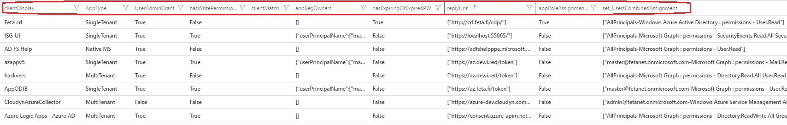
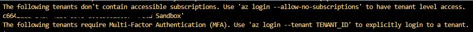

- [License](#license)
- [Consent Analytics solution](#consent-analytics-solution)
  - [Illicit Consent Grant](#illicit-consent-grant)
- [Use cases](#use-cases)
- [Intentional gaps](#intentional-gaps)
- [Prerequisites](#prerequisites)
  - [About the generated KQL](#about-the-generated-kql)
- [Running the tool](#running-the-tool)
- [After initial run](#after-initial-run)
  - [Checking results again](#checking-results-again)
  - [Checking with sign-ins](#checking-with-sign-ins)
  - [Use existing storage account](#use-existing-storage-account)
  - [Regenerate SAS tokens for existing data](#regenerate-sas-tokens-for-existing-data)
- [Update log](#update-log)
- [Known issues](#known-issues)
  - [Continous Access Evaluation](#continous-access-evaluation)
  - [Multiple tenants](#multiple-tenants)

## License

[READ HERE](https://github.com/jsa2/CloudShellAadApps/blob/public/LICENSE)

---
 
  ⚠ Only use this tool if you know what you are doing and have reviewed the code

  ⚠ Always test the tool first in test environments, with non-sensitive data

---
As the licenses says, 0%  Liability 0% Warranty

---
## Consent Analytics solution
Azure AD consent framework analysis is important step to strengthen security posture in every organization that is using Azure Active Directory. This tool was initially developed to analyze possible illicit consent grant attacks & in help of analyzing Azure AD consent grant framework but has been developed further since to provide answers to the most typical security related questions around Azure AD integrated apps and permissions.

### Illicit Consent Grant

During Covid-19 there has been huge increase in consent phishing emails where the idea is to abuse OAuth request links to trick recipients into granting attacker owned apps permission to access sensitive data. Consent grant is perfect tool to create backdoor, and MFA bypasses in the victim’s environment. After the illicit application has been granted consent, it has account-level access to data without the need for an organizational account.

There are two scenarios for attacker to pursue targeting individual users:
- Individual consent grants for non-admin permissions
- Targeting admins for requiring permissions that only admins can grant
  
  Both scenarios allows data exfiltration, while the latter also offers perfect backdooring entry (App permissions for multi-tenant app). More information about the attack and analysis can be found from the following sources:
  - [Azure AD Attack & Defense Playbook](https://github.com/Cloud-Architekt/AzureAD-Attack-Defense)
  - [MITRE ATT&ACK - Steal Application Token](https://attack.mitre.org/techniques/T1528/)
  - [Detect & Remediate ](https://docs.microsoft.com/en-us/microsoft-365/security/office-365-security/detect-and-remediate-illicit-consent-grants?view=o365-worldwide)


## Use cases

Use Case Name | Notes
-|-
✅ Inventory of apps and permissions | All Azure AD apps and the apps registered permissions including Workload Identities
✅ Detect applications that share app and user permissions / scopes | By default Apps that have delegated permissions should not include Application permissions
✅ Detect password use on applications, and expiring/expired passwords | [Two types of credentials available](https://docs.microsoft.com/en-us/azure/active-directory/develop/howto-create-service-principal-portal#authentication-two-options): password-based or certificate-based authentication
✅ Detect AppType (Managed, Multi, single etc) | [Tenancy in Azure AD](https://docs.microsoft.com/en-us/azure/active-directory/develop/single-and-multi-tenant-apps)
✅ Review replyURLs | Verify are there any malicious [reply URLs](https://docs.microsoft.com/en-us/azure/active-directory/develop/reply-url) used in the apps
✅ Detect recent sign-ins | Get insights on how apps are used in the organization (this API is setting not enabled by default)
✅ Detect servicePrincipals in admin roles | It is in most cases recommended to use API permissions instead of AAD roles 
✅ Detect dangling redirect_uri | If the app service is deleted, but redirect_uri is not deleted from the Azure AD app registration, attacker could register the App Service instance for malicious intent.




## Intentional gaps
⚠️ There are also occurences where required ResourceAccess are configured on the apps, but no permissions are granted to users via user consent, or admin consent. These occurences do not show on the report. While they also have potential for abuse, they have no active permissions granted. (this does not concern app permissions)

## Prerequisites 

Requirement | description |
-|-
✅ Access to Azure Cloud Shell Bash | Uses pre-existing software on Azure CLI, Node etc 
✅ Permissions to Azure subscription to create needed resources | Tool creates a storage account and a resource group. Possible also to use existing storage account. In both scenarios tool generates short lived read-only shared access links (SAS) for the ``externalData()`` -[operator](https://docs.microsoft.com/en-us/azure/data-explorer/kusto/query/externaldata-operator?pivots=azuredataexplorer#examples)
✅ User is Azure AD member |Cloud-only preferred with read-only Azure AD permissions. More permissions are needed if sign-in events are included 
✅ Existing Log Analytics Workspace | This is where you paste the output from this tool

### About the generated KQL
- The query is valid for 10 minutes, as SAS tokens are only generated for 10 minutes
- If you want to regenerate the query follow these  [steps](#regenerate-sas-tokens-for-existing-data)

## Running the tool

- Log in to Azure Cloud Shell (**BASH** ) and paste following line to the shell
```bash
curl -o- https://raw.githubusercontent.com/jsa2/CloudShellAadApps/public/remote.sh | bash
```
Once complete you should see following screen, which includes that you can paste to Log Analytics space


## After initial run
- nvm use 14, is only needed in cloud shell
- If you are having problems with the tool start by ensuring, that existing installation of the tool does on exist in cloudShell: ``admin@Azure:~$ rm CloudShellAadApps/ -r -f`` 


### Checking results again
```bash
cd Cloud CloudShellAadApps
nvm use 14; node main.js
```

### Checking with sign-ins 
If you want to include sign-ins login with the account that has necessary permissions defined to read sign-in logs
```bash
cd Cloud CloudShellAadApps
nvm use 14; node mainSignIns.js
```

### Use existing storage account 
```bash
rg=queryStorage-23428
storageAcc=storagehowrjcehuw
git clone https://github.com/jsa2/CloudShellAadApps
cd CloudShellAadApps
az storage account show-connection-string -g $rg  -n  $storageAcc -o json  > src/config.json
npm install
nvm use 14; node main.js
```

### Regenerate SAS tokens for existing data
```bash
cd Cloud CloudShellAadApps
nvm use 14; node schemaForExternalData.js
code kql/runtime.kql
```

## Update log


⚠️ Dangling redirect URI

-  Malicious use case: If the app service is deleted, but redirect_uri is not deleted from the Azure AD app registration, attacker could register the App Service instance for malicious intent. After registering the App Service instance Attacker would then redirect user sessions authorization codes/tokens to attacker controlled service.

⚠️ Multi-tenant app with app permissions.

⚠️ Device Code Flow enabled for app that has redirect URI's
  - This enables the attacker to phish for access tokens without having control of the redirect URI as the attacker is able to set up an page asking for the device code. 
    - Users are likely less susceptible to device code based phishing * compared to pure SSO based phishing with seamless redirect to attacker controlled service) - Nonetheless public client on a redirect enabled application presents a valid attack vector.


## Known issues
### Continous Access Evaluation
Azure CLI is unable to obtain new access tokens for sessions, that rely on IP restrictions and are targeteted by [strict enforcement](https://docs.microsoft.com/en-us/azure/active-directory/conditional-access/concept-continuous-access-evaluation#ip-address-variation)
``az account get-access-token --resource=https://graph.microsoft.com --query accessToken --output json`` 


### Multiple tenants
If the identity you are using doesn't have Azure subscription access or has access to multiple tenants use
```bash 
az login --allow-no-subscriptions ## (no access to Azure subscriptions)
```

```bash 
az login --tenant <tenant id>  ## (If user has identity in multiple tenants)
```
